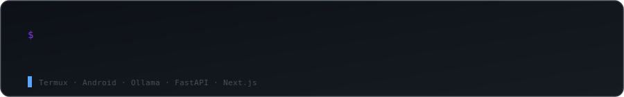

<div align="center">



**Local-first AI email intelligence** — classification, prioritization, summarization, and reply generation, running entirely on infrastructure you control.


Built by [Syed Ali Hasan Moosavi](#author) — [Sayanjali Nexus](#about-sayanjali-nexus)

</div>

---

## Table of contents

- [Why this exists](#why-this-exists)
- [What's inside](#whats-inside)
- [Architecture](#architecture)
- [Safety mechanisms](#safety-mechanisms)
- [Technology stack](#technology-stack)
- [Project structure](#project-structure)
- [Requirements](#requirements)
- [Installation](#installation)
- [Running the backend](#running-the-backend)
- [Testing](#testing)
- [API reference](#api-reference)
- [Deployment](#deployment)
- [Current status](#current-status)
- [Roadmap](#roadmap)
- [Author](#author)
- [License](#license)

---

## Why this exists

Most "AI inbox" tools route email through a third-party cloud model. This doesn't. Classification, importance scoring, summarization, and reply drafting all run locally through Ollama — the content of your email never leaves your own infrastructure. On top of that local reasoning pipeline sits a REST API and a dashboard: Gmail in, structured intelligence and drafted replies out, gated by a deterministic approval workflow that decides what gets auto-sent, drafted for review, or escalated to a human.

The backend and dashboard run the same way on a Windows machine, a Linux server, a Mac, or an Android phone in Termux — the AI layer is model-and-runtime driven, not tied to any one OS.

<div align="center">



</div>

---

## What's inside

<details open>
<summary><strong>AI email classification</strong></summary>
<br>

Each email is sorted into one of 22 business-relevant categories (`Urgent`, `Important`, `Client`, `Finance`, `Invoice`, `HR`, `Support Ticket`, `Security Alert`, `Phishing`, `Meeting`, and others), using a prompt tuned to avoid the most common classifier failure mode: mistaking urgency-flavored marketing language for genuine urgency.
</details>

<details>
<summary><strong>Importance scoring</strong></summary>
<br>

A 1–100 importance score with plain-English reasoning and automatic deadline detection, normalized so malformed model output (stray `"null"` strings, non-English text) never reaches the database.
</details>

<details>
<summary><strong>AI summarization</strong></summary>
<br>

One-line and detailed summaries, extracted action items, requested tasks, and detected deadlines — generated for every email that isn't auto-archived.
</details>

<details>
<summary><strong>AI reply generation</strong></summary>
<br>

- Writing-style-aware draft generation via a local LLM
- Per-draft confidence scoring
- Echo prevention: a similarity check compares each generated reply against the source email; a paraphrased or echoed response triggers one regeneration with a stricter prompt before falling back to a safe, professional template
- Every path terminates in a safe, non-empty reply
</details>

<details>
<summary><strong>Approval workflow</strong></summary>
<br>

Three configurable confidence thresholds route every drafted reply:

- **Auto-send** — high-confidence replies go out immediately
- **Gmail draft** — mid-confidence replies are created as Gmail drafts pending one-click approval
- **Manual review** — lower-confidence replies stay in the dashboard for editing
</details>

<details>
<summary><strong>Gmail integration</strong></summary>
<br>

Polling, thread detection, draft creation, auto-reply sending, archiving, and read-state management via the Gmail API.
</details>

<details>
<summary><strong>Notifications</strong></summary>
<br>

Telegram is live today. The notification layer is channel-agnostic and built to extend to Slack, Discord, Microsoft Teams, email, and generic webhooks.
</details>

<details>
<summary><strong>Dashboard (beta)</strong></summary>
<br>

A Next.js 14 executive dashboard now sits on the FastAPI backend, authenticated via JWT with HTTP-only cookies and protected middleware:

- Inbox with live polling, priority badges, and category labels
- Email detail view with AI summaries, reasoning, and suggested replies
- Manual review and draft approval queues
- Contact intelligence, analytics, notification history, prompt editor, settings, and system logs
</details>

<details>
<summary><strong>REST API</strong></summary>
<br>

A FastAPI backend exposing emails, drafts, contacts, notifications, analytics, logs, settings, and live prompt management — the same API the dashboard consumes.
</details>

---

## Architecture

```
                     Gmail Inbox
                          │
                          ▼
                   Gmail Poller
                          │
                          ▼
                  process_email()
                          │
        ┌─────────────────┼─────────────────┐
        ▼                 ▼                 ▼
 Classification      Importance       Summarization
        │                 │                 │
        └────────────┬────┴─────────────────┘
                      ▼
              SQLite Database
                      │
                      ▼
             Reply Generation
           (similarity-checked,
          regenerate-or-fallback)
                      │
                      ▼
         Approval Decision Engine
                      │
      ┌───────────────┼───────────────┐
      ▼               ▼               ▼
 Auto Send      Gmail Draft     Manual Review
                      │
                      ▼
             Notification System
                      │
                      ▼
            FastAPI REST Backend
                      │
                      ▼
      Next.js Dashboard (JWT-authenticated)
```

Every AI stage is wrapped in its own try/except. A failure in classification, importance scoring, summarization, or reply generation never drops the email or crashes the pipeline — it falls back to a safe default, flags the email for manual review, and logs the specific failure reason.

---

## Safety mechanisms

| Mechanism | What it prevents |
|---|---|
| Reply similarity detection | The model echoing or paraphrasing the incoming email instead of responding to it |
| Regenerate-then-fallback | One retry with a stricter prompt before falling back to a safe template |
| Deadline/null normalization | Inconsistent model output corrupting stored data |
| English-only enforcement | The model drifting into another language mid-response |
| `needs_manual_review` flagging | AI failures going unnoticed — every failure is logged and surfaced |
| Provider fallback | A single model outage taking down the pipeline (Qwen 14B → Qwen 7B) |
| JWT + HTTP-only cookies | Session hijacking and token exposure to client-side scripts |
| Server-side API proxy | Direct client exposure of the backend |

---

## Technology stack

| Layer | Technology |
|---|---|
| Backend | Python 3.13+, FastAPI, SQLAlchemy, SQLite, Alembic, Uvicorn |
| AI | Ollama, Qwen2.5 14B (primary), Qwen2.5 7B (fallback) |
| Frontend | Next.js 14.2.35, React 18.3.1, TypeScript 5.6, Tailwind CSS, Lucide Icons |
| Auth | JWT (HTTP-only cookies), Google OAuth (Gmail) |
| Notifications | Telegram Bot API |

---

## Project structure

<details>
<summary>Click to expand</summary>
<br>

```
assets/
    header-typing.svg   # animated typewriter header (SMIL, no JS/service dependency)
    stat-cards.svg       # animated count-up stat cards (SMIL)

app/
    ai/             # classifier, importance scorer, summarizer, reply generator
    api/            # FastAPI routes
    core/           # database, logger, models, time utils
    gmail/          # Gmail client, polling
    notifications/  # Telegram + notification abstraction
    workflows/      # process_email() pipeline orchestration

config/
    prompts/        # classify.txt, importance.txt, reply.txt — hot-reloaded, no restart needed
    config.py       # thresholds, categories, auto-handling rules

dashboard/          # Next.js frontend (JWT auth, executive UI)
tests/
scripts/
deploy/
data/
migrations/
```
</details>

---

## Requirements

| Requirement | Version / notes |
|---|---|
| Python | 3.11 or newer (3.13 recommended) |
| Node.js | 18 or newer (for the dashboard) |
| Ollama | Latest — used for local LLM inference |
| Git | Any recent version |
| RAM | 8 GB minimum; 16 GB+ recommended for the 14B model |
| Disk space | ~10 GB free for models (Qwen2.5 14B + 7B) |
| Gmail account | With API access enabled via Google Cloud Console |

The AI models run through Ollama regardless of OS, so inference behavior is identical across platforms — only the setup steps differ.

---

## Installation

Pick the section for your OS. All platforms end up running the same backend and dashboard.

<details>
<summary><strong>🪟 Windows</strong></summary>
<br>

**Requirements:** Windows 10/11, Python 3.11+, Node.js 18+, Git for Windows.

```powershell
# Install Python, Node.js, and Git if not already installed (via winget)
winget install Python.Python.3.13
winget install OpenJS.NodeJS.LTS
winget install Git.Git
```

```powershell
git clone <YOUR_REPOSITORY_URL>
cd syj-mail-intelligence-ai
```

```powershell
python -m venv .venv
.venv\Scripts\activate
pip install -r requirements.txt
```

Install [Ollama for Windows](https://ollama.com/download/windows), then pull the models:

```powershell
ollama pull qwen2.5:14b
ollama pull qwen2.5:7b
```

Copy `.env.example` to `.env` and configure as described in [Environment variables](#environment-variables).

> **Note:** Native `next build` works fine on Windows. If you hit native-module issues with certain Python packages, running the backend inside **WSL2** (Ubuntu) is a solid fallback — treat it as the Linux path below.
</details>

<details>
<summary><strong>🐧 Linux</strong></summary>
<br>

**Requirements:** Ubuntu 22.04+/Debian 12+/Fedora 39+ (or equivalent), Python 3.11+, Node.js 18+.

```bash
# Debian / Ubuntu
sudo apt update && sudo apt install -y python3 python3-venv python3-pip \
  git build-essential nodejs npm sqlite3
```

```bash
# Fedora
sudo dnf install -y python3 python3-pip git gcc gcc-c++ make nodejs npm sqlite
```

```bash
git clone <YOUR_REPOSITORY_URL>
cd syj-mail-intelligence-ai
```

```bash
python3 -m venv .venv
source .venv/bin/activate
pip install -r requirements.txt
```

Install [Ollama for Linux](https://ollama.com/download/linux), then pull the models:

```bash
curl -fsSL https://ollama.com/install.sh | sh
ollama pull qwen2.5:14b
ollama pull qwen2.5:7b
```

Copy `.env.example` to `.env` and configure as described in [Environment variables](#environment-variables). This is also the reference environment for Docker, Railway, and other Linux-based deployment targets.
</details>

<details>
<summary><strong>🍎 macOS</strong></summary>
<br>

**Requirements:** macOS 13+, Python 3.11+, Node.js 18+, Homebrew.

```bash
brew install python@3.13 node git sqlite
```

```bash
git clone <YOUR_REPOSITORY_URL>
cd syj-mail-intelligence-ai
```

```bash
python3 -m venv .venv
source .venv/bin/activate
pip install -r requirements.txt
```

Install [Ollama for macOS](https://ollama.com/download/mac), then pull the models:

```bash
ollama pull qwen2.5:14b
ollama pull qwen2.5:7b
```

Copy `.env.example` to `.env` and configure as described in [Environment variables](#environment-variables). On Apple Silicon, Ollama uses the GPU/Metal backend automatically — no extra configuration needed.
</details>

<details>
<summary><strong>📱 Android (Termux)</strong></summary>
<br>

**Requirements:** Termux (F-Droid build, not the Play Store version), Android 8+, ~4 GB free storage.

Backend development is native to Termux — no emulator or desktop required.

```bash
pkg update && pkg upgrade
pkg install python git clang rust sqlite nodejs build-essential
```

```bash
git clone <YOUR_REPOSITORY_URL>
cd syj-mail-intelligence-ai
```

```bash
python -m venv .venv
source .venv/bin/activate
pip install -r requirements-termux.txt
```

Install Ollama for your platform (via a Linux distro under Termux, e.g. proot-distro, or point `OLLAMA_HOST` at a remote instance), then pull the models:

```bash
ollama pull qwen2.5:14b
ollama pull qwen2.5:7b
```

Copy `.env.example` to `.env` and configure as described in [Environment variables](#environment-variables).

> **Known limitation:** local production builds (`next build`) are not currently supported on Android/Termux — the required SWC binary isn't available for `android/arm64`. `npx tsc --noEmit` and `next dev` work fine in Termux; run `next build` on Vercel, Linux, GitHub Actions, Railway, Docker, or WSL2.
</details>

### Gmail credentials

On any platform: place `credentials.json` and `token.json` in the project root (see Google Cloud Console for OAuth setup).

### Environment variables

Copy `.env.example` to `.env` and configure:

<details>
<summary>Show full <code>.env</code> reference</summary>
<br>

```env
ENVIRONMENT=development
DATABASE_URL=sqlite:///./data/syj_mail.db

LLM_PROVIDER=ollama
OLLAMA_HOST=http://localhost:11434
LLM_MODEL=qwen2.5:14b
LLM_FALLBACK_MODEL=qwen2.5:7b
LLM_TIMEOUT_SECONDS=60

AUTO_SEND_THRESHOLD=95
APPROVAL_THRESHOLD=80
IMPORTANCE_NOTIFY_THRESHOLD=70

GMAIL_CREDENTIALS_FILE=credentials.json
GMAIL_TOKEN_FILE=token.json
GMAIL_POLL_INTERVAL_SECONDS=60
GMAIL_USER_EMAIL=me

TELEGRAM_BOT_TOKEN=
TELEGRAM_CHAT_ID=

JWT_SECRET=
JWT_EXPIRY_MINUTES=60

API_HOST=0.0.0.0
API_PORT=8000
API_KEY=
CORS_ALLOW_ORIGINS=http://localhost:3000
RATE_LIMIT_PER_MINUTE=30
```

> `API_KEY` and `JWT_SECRET` are required in production — the app refuses to start with `ENVIRONMENT=production` and either unset, since this backend can send email and expose dashboard sessions on your behalf.
</details>

### Dashboard (all platforms)

```bash
cd dashboard
npm install
npm run dev
```

`npm run build` works natively on Windows, Linux, and macOS. On Termux, use the remote-build workaround noted above.

---

## Running the backend

```bash
python main.py
# or
uvicorn app.api.main:app --reload
```

Health check: `GET /health`

---

## Testing

```bash
pytest                                        # full suite
pytest tests/test_pipeline_resilience.py      # a specific test
```

### Regression suite

A 28-case regression suite validates classification accuracy, importance scoring, echo detection, similarity protection, and approval routing against representative real-world email types (critical outages, invoices, support tickets, GitHub notifications, marketing, personal mail, spam/phishing):

```bash
python run_regression.py
```

Results are written to a spreadsheet — classification accuracy, priority accuracy, reply quality, echo rate, and fallback rate are tracked against explicit targets before any release is considered production-ready.

---

## API reference

<details>
<summary>Click to expand endpoint list</summary>
<br>

```
GET     /health
GET     /ready

POST    /auth/login
POST    /auth/logout

GET     /emails
GET     /emails/{id}
GET     /emails/important

GET     /drafts
GET     /drafts/pending
POST    /drafts/{id}/approve
POST    /drafts/{id}/reject

GET     /notifications
GET     /contacts
GET     /logs

GET     /analytics/summary

GET     /settings

GET     /prompts
GET     /prompts/{name}
PUT     /prompts/{name}
```
</details>

---

## Deployment

| Component | Recommended |
|---|---|
| Backend | Railway, VPS, Docker, Ubuntu Server |
| Dashboard | Vercel |
| AI inference | Local/self-hosted Ollama |
| Database | SQLite (dev) → PostgreSQL (planned) |

---

## Current status

**Backend** — feature complete, regression tested, prompt-hardened (echo prevention, false-urgency correction, English enforcement), approval workflow, Gmail integration, REST API.

**Dashboard** — beta. JWT authentication, protected routing, inbox, email detail view, manual review queue, draft approval, notifications, contacts, analytics, prompt management, settings, and logs are implemented and TypeScript-verified. No automated frontend test suite yet; end-to-end testing and performance tuning are planned ahead of v1.0.0.

**Current release:** `v1.0.0-beta1`

---

## Roadmap

| Version | Focus |
|---|---|
| `v1.0.0` | Production deployment, end-to-end testing, performance tuning, security review |
| `v1.1.0` | Reply editor, retry workflow, analytics enhancements |
| `v1.2.0` | Multi-user support and RBAC |
| `v2.0.0` | Multi-tenant SaaS release |

---

## Author

**Syed Ali Hasan Moosavi**
Founder & Managing Director, Sayanjali Nexus Private Limited — Hyderabad, Telangana, India

Full-stack builder and AI automation specialist working with SMEs, hospitals, logistics firms, and Gulf-based enterprises. Fluent in English, Urdu, Hindi, Telugu, and Arabic, with work experience across India, Qatar, and Saudi Arabia. Certified in AI Fundamentals (IBM SkillsBuild) and Claude 101 / AI Fluency (Anthropic).

Every part of this project has been built and tested across Termux, Linux, and Windows environments.

### About Sayanjali Nexus

SYJ Mail Intelligence AI is one product in a wider ecosystem under Sayanjali Nexus, including:

- **NexusRank AI** — SEO/AEO/GEO ranking intelligence
- **Sayanjali OSINT** — unified CLI geolocation intelligence tool
- **SYJ Scholar AI** — Akhbari Shia hadith research platform with multilingual support
- **SYJ ONE** — unified project/brand hub
- **AI Zara Web Widget** — embeddable conversational AI widget
- **SYJ GitHub Optimizer** — GitHub profile and repo automation (Node.js / Octokit)
- **Sayanjali Cyberdeck** — terminal-style security dashboard (Python/Textual + React)

Client and family-business work under the same builder includes systems for M K Enterprises, Ace Livestock Farms, Alison Holidays, and Moosavi Farming.

---

## License

MIT License — see `LICENSE`.

---

## Contact

For collaboration or freelance systems work, reach out through the Sayanjali Nexus channels linked from the author's portfolio.

<div align="center">

---

Built to run anywhere. Shipped like a product.

</div>
